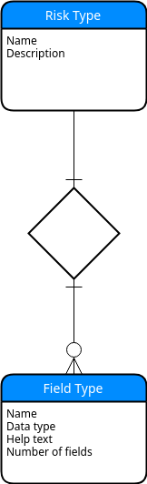

# Denis Angulo's project submission

## TOC

- [About](#about)
- [Links to deployed versions](#links)
    - [AWS Lambda / S3](#aws-lambda)
- [Approach](#approach)
- [Deliverable summary](#deliverables)
- [Deployment](#deployment)
    - [Before deploying](#before-deploying)
        - [Configuring AWS cli](#configure-aws-cli)
        - [Pipenv](#configure-pipenv)
        - [Additional deployment notes](#addtl-deployment-notes)
    - [Deploy to AWS-Lambda](#deploy-aws-lambda)
    - [Deploy to AWS-EC2](#deploy-aws-ec2)
    - [Un-deploy](#undeploy)
- [Closing comments](#closing-comments)

## About

Hello, and welcome to my application project.

This is Denis Angulo's project submission for the Software Developer (Product Development) postion (posted [here](https://engineering-application.britecore.com/do/product-engineer-western-hemisphere)).

This project was built with the following technologies:

* django
* django-rest-framework
* Vue.js
* vue-Bootstrap
* nodejs 10.11.0 (npm 6.4.1)
* Amazon Web Services
* boto3
* pipenv

## Links to the deployed version

#### AWS-Lambda / S3

Main page:

https://s3.amazonaws.com/static-vue-bucket/index.html

API root view:

https://9j67xix7w5.execute-api.us-east-2.amazonaws.com/prod/api/v1.0/

[Back to TOC](#toc)

---

## Approach

This solution allows clients to define their own models via web-application forms. These fields, attached to a Risk description, trigger a new NoSQL database table creation (simulated in the front end using Vue and localStorage).

The models presented in the `risks/models.py` file act as metadata tables, holding the data that allows the system to connect to the would-be actual database tables (in this case, merely JavaScript objects managed through Vuex).

Database table names are defined by the insurer, as defined by the RiskType name. The insurer is able to attach as many FieldTypes (to the RiskType object) as they like, without naming restrictions, as they only pertain to a particular risk.

For the API creation, Django with Django-REST-Framework was used, as it is an incredibly powerful tool for API creation.

Tables were modeled rather straightforwardly (by Django standards), by creating a RiskType model, and a FieldType model, then relating the FieldType to the RiskType via a foreign key. These tables are arranged as follows:

`RiskType` fields:

- `name` -- CharField.
- `slug` -- SlugField. Non-editable; set on model save.
- `description` -- CharField.

`FieldType` fields:

- `name` -- CharField.
- `slug` -- SlugField. Non-editable; set on model save.
- `data_type` -- IntegerField. Choices for data types (`text`, `number`, `date`, `enum`).
- `help_text` -- CharField. Help text to display on form field.
- `display_order` -- IntegerField. Order in which fields are displayed in the form.
- `enum_options` -- CharField. Helper field for enum types. Entered like a comma separated list of entries.
- `risk` -- ForeignKey::RiskType Non-equired, nullable foreign key field to the RiskType model.

The reader may notice that only the RiskType model's name is unique (while the FieldType's is not). This is by design, since the frontend couples tightly the FieldType to the RiskType on creation. This prevents accidentally deleting another RiskType's fields when deleting any RiskType instance.

The foreign key was left un-required (blank=True) and nullable, in this manner the app is allowed to hit the API to create FieldType objects without having to attach it to a RiskType object. A helper method, `bulk_add_fields`, was created on the RiskType model, to get-or-create an incoming FieldType set on the RiskType API endpoint.

For the frontend, Vue.js was used along with Vuex, as the state management of Vuex can leverage the interaction needed between the components. All API calls and form rendering happen through the Vue application.

The full implementation (what is implied by the description), is that this will be a dynamic model generator, where the Django API and models act as metadata tables, who in turn are pointed programmatically to another database containing the actual tables for the forms generated by Vue and the API. This was simulated by the Vue application, and it illustrates how the real interactions would play out.

This is a conceptual project, however, if I had to fully implement the description above, I would do so by creating an AWS DynamoDB instance (or any other NOSQL database), with endpoints that accept requests from our API (Django). The Vuex store would act as a mid-point, to stage changes before sending them in bulk to the Django API (which would in turn parse them and forward them to the actual NOSQL endpoint). NOSQL offers more flexibility when it comes to dynamic models like the one described above (SQL schemas can be rather rigid, specially if scaled).

For [deployment](#deployment), several steps had to be covered:

- The PostgreSQL database, the API and the front-end would all end up in different locations
    - It was planned like this in order to leverage the convenience of Zappa (and the power of AWS)
    - This means that deployment has to happen sequentially, as each resource needed the addresses at least one other resource
- Thankfully, there are similar libraries for npm that (very much like zappa), bundle the node.js application and upload it into an S3 bucket as a static site.
- Boto3, and it's `waiters` features were used to hold on deployment of the Django API and the Static Vue app, until RDS instance was ready to accept connections.

[Back to TOC](#toc)

---

## Deliverables

1. A README that describes your approach and how to deploy your project.
    - You're reading it!
    - For details about deployment, see the [deployment](#deployment) section.
2. Link(s) to the deployed version of your project.
    - See [links](#links)
3. Bonus points if you also orchestrate the launch environment in AWS using CloudFormation.
    - Thanks to Boto3, Zappa and [vue-cli-plugin-s3-deploy](https://www.npmjs.com/package/vue-cli-plugin-s3-deploy), the need for orchestrating with CloudFormation was never there.
4. Mega bonus points if you host the app in AWS Lambda using Zappa or AWS ECS using AWS Fargate.
    - Deployment uses AWS-lambda (for Django) and an S3 bucket (for the Vue app).
    - See [the AWS-Lambda deployment section](#deploy-aws-lambda) for more details
5. A Python file containing the ORM classes for these tables.
    - See `risks/models.py`
    - A copy of the `models.py` file is found in the `deliverables` directory.
6. An entity relationship diagram, which depicts the tables and their relationship to one another.
    - See below
    - A copy of the `ERD.png` file is found on the `deliverables` directory.
    

    
    

7. A well-tested REST API written in Python.
    - Tests are found in `risks/tests/test_api.py`.
    - Django-REST-framework's DefaultRouter explorer view was left enabled, in case you would want to explore it. You can find direct links in [the links section](#links)
8. If using Django, you must use Django and/or Django REST Framework's Class-Based Views.
    - See the `risks/api.py` file, where Django REST framework Viewsets are defined.
9. Create a single page that hits your risk type API endpoint(s) and displays all of the fields to the user in 
a form. Be sure to display at least one field of each type on the page. Don't worry about submitting the 
form.
    - The main application page does this (see [links](#links). The column on the left allows you to:
        - Select one of the existing Risk Types
            - Once selected, a form and a table show appear
                - The form feeds data into the table when submitted
                - The tables can optionally be saved to localStorage, for persistence
        - Create a new Risk Type
            - Click the "Add field" button to add fields
            - Then, for each field
                - Select the field type
                - Add a name for the field
                - Add help text for the field
                - (ENUM only) add the comma separated list of options to be passed to the form
10. Fields should use appropriate widgets based on their type. text fields should display as text boxes, date 
fields should use date pickers, and so on.
    - Click any of the sample Risk Types to see the field forms implemented.
11. Bonus points if you come up with an elegant response for when users click on an unactivated form submit 
button.
    - The risk form has a validation system built-in. If the user attempts to submit the risk creation form with:
        - A blank "Name" field
        - A field with a blank "Name"
        - A risks that already exists (in the Vuex state, which should mirror the database)
12. Mega bonus points for handling form submission.
    - Risk form submission is simulated using the Vuex store. Risk form fields are added to the tables at the bottom right.
    - Form submission for risk creation is also implemented.

[Back to TOC](#toc)

---

# Deployment

## Before deploying

There are several steps to take prior to installation:

#### Configure aws-cli

Create a dir in ~/.aws/credentials with the following structure:

    [default]
    aws_access_key_id=YOURACCESSKEY
    aws_secret_access_key=YOURSECRETKEY

in order to not have to enter them for every call to aws-cli. The files `deploy/zappa_settings_template` "vpc_config" config entries have to be updated., to contain your own `SubnetIds` and `SecurityGroupIds`

#### Pipenv

This project requires pipenv to deploy, so please install pipenv. Quoting the official docs:

If you're on MacOS, you can install Pipenv easily with Homebrew:

    $ brew install pipenv

Or, if you're using Fedora 28:

    $ sudo dnf install pipenv

You could otherwise install it directly with pip

    $ pip install --user pipenv

If all else fails, you could do a direct download:

    $ curl https://raw.githubusercontent.com/kennethreitz/pipenv/master/get-pipenv.py | python

Keep in mind that some distributions alias python 2 as python, and python3 for python 3.

#### Additional deployment notes

Besides the dependencies above, the scripts make heavy use of [gnu sed](https://www.gnu.org/software/sed/) and [gnu grep](https://www.gnu.org/software/grep/). Remember that if any of the scripts fail to run, you can just run the commands manually to deploy.

[Back to TOC](#toc)

---

## Deploy to AWS-Lambda

Once pipenv is installed, is as simple as running the script at `deploy.sh`.

**Prior** to running the script, the environment variables SQL_PASSWORD and SECRET_KEY need to be set, the following snippets should do it

    $ export SQL_PASSWORD=$(head /dev/urandom | tr -dc A-Za-z0-9 | head -c 50; echo '')
    $ export SECRET_KEY=$(head /dev/urandom | tr -dc A-Za-z0-9 | head -c 50; echo '')

This deployment takes some time, as it needs to wait for the RDS Postgres instance to be available before proceeding to deploy the Django app and the Vue app.

Then the script will:

* Run pipenv install
* Create an AWS RDS db-instance through boto3
* Wait for the database to become available (through boto3 `watiers`)
* Modify some template files in `deploy/`
* It will then proceed to deploy with zappa
* Once zappa is finished, it will deploy the Vue.js application
* Finally, it will migrate and create sample risk policies to display

[Back to TOC](#toc)

---

## Un-deploy

To take down the app:

* If deployed with AWS/Zappa, run `pipenv run zappa undeploy -y`
* The plugin used for Vue.js deployment has no undeploy option.
    - Use the `aws-cli` to clear or delete the S3 Bucket
    - Or simply go into the AWS console and remove the files/bucket manually
* To take down the RDS instance:
    - Use the `aws-cli`, and run `aws delete-rds-instance <instance-name>`
    - Or simply, go into the AWS console and delete the instance manually

[Back to TOC](#toc)

---

## Closing comments

Thank you for taking the time to review my project.

I have thoroughly enjoyed working on this project. Even though I used technologies I'm very familiar with (Django, Django-REST-Framework), I had the chance to work with some other technologies that I did not have a lot of experience with (Vue, AWS); and some that are entirely new to me (Zappa is my new favorite toy!).

Once again, thank you for your time.

Kind regards,

\- Denis Angulo

[Back to TOC](#toc)

